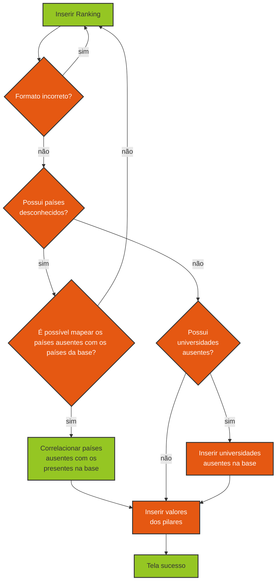

# Testes

## Inserir Ranking

```mermaid
flowchart TD
    style InserirRanking fill:#95C623,stroke:#333,stroke-width:2px
    style CorrelacionarPaisesAusentes fill:#95C623,stroke:#333,stroke-width:2px
    style TelaSucesso fill:#95C623,stroke:#333,stroke-width:2px

    style PaisesAusentes fill:#E55812,color:#fff,stroke:#333,stroke-width:2px
    style PaisesCorrelacionaveis fill:#E55812,color:#fff,stroke:#333,stroke-width:2px
    style UniversidadesAusentes fill:#E55812,color:#fff,stroke:#333,stroke-width:2px
    style InserirUniversidades fill:#E55812,color:#fff,stroke:#333,stroke-width:2px
    style InserirPilares fill:#E55812,color:#fff,stroke:#333,stroke-width:2px
    style FormatoIncorreto fill:#E55812,color:#fff,stroke:#333,stroke-width:2px


    InserirRanking["Inserir Ranking"]
    CorrelacionarPaisesAusentes["Correlacionar países<br>ausentes com os<br>presentes na base"]
    TelaSucesso["Tela sucesso"]
    
    PaisesAusentes{"Possui países<br>desconhecidos?"}
    PaisesCorrelacionaveis{"É possível mapear os países ausentes com os países da base?"}
    UniversidadesAusentes{"Possui<br>universidades<br>ausentes?"}
    InserirUniversidades["Inserir universidades<br>ausentes na base"]
    InserirPilares["Inserir valores<br>dos pilares"]
    FormatoIncorreto{"Formato incorreto?"}
    

    InserirRanking --> FormatoIncorreto
    FormatoIncorreto -- "sim" --> InserirRanking
    FormatoIncorreto -- "não" --> PaisesAusentes
    PaisesAusentes -- "sim" --> PaisesCorrelacionaveis
    PaisesCorrelacionaveis -- "sim" --> CorrelacionarPaisesAusentes
    CorrelacionarPaisesAusentes --> InserirPilares
    PaisesCorrelacionaveis -- "não" --> InserirRanking
    PaisesAusentes -- "não" --> UniversidadesAusentes
    UniversidadesAusentes -- "sim" --> InserirUniversidades
    UniversidadesAusentes -- "não" --> InserirPilares
    InserirUniversidades --> InserirPilares
    InserirPilares --> TelaSucesso
```