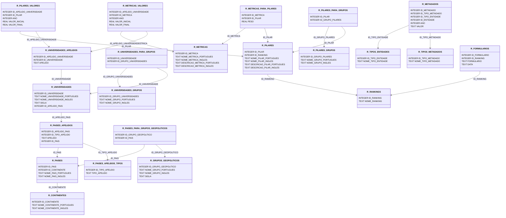

```mermaid
classDiagram
    class R_CONTINENTES {
        INTEGER ID_CONTINENTE
        TEXT NOME_CONTINENTE_PORTUGUES
        TEXT NOME_CONTINENTE_INGLES
    }
    class R_PAISES {
        INTEGER ID_PAIS
        INTEGER ID_CONTINENTE
        TEXT NOME_PAIS_PORTUGUES
        TEXT NOME_PAIS_INGLES
    }
    class R_PAISES_APELIDOS_TIPOS {
        INTEGER ID_TIPO_APELIDO
        TEXT TIPO_APELIDO
    }
    class R_PAISES_APELIDOS {
        INTEGER ID_APELIDO_PAIS
        INTEGER ID_TIPO_APELIDO
        TEXT APELIDO
        INTEGER ID_PAIS
    }
    class R_GRUPOS_GEOPOLITICOS {
        INTEGER ID_GRUPO_GEOPOLITICO
        TEXT NOME_GRUPO_PORTUGUES
        TEXT NOME_GRUPO_INGLES
        TEXT SIGLA
    }
    class R_PAISES_PARA_GRUPOS_GEOPOLITICOS {
        INTEGER ID_GRUPO_GEOPOLITICO
        INTEGER ID_PAIS
    }
    class R_UNIVERSIDADES {
        INTEGER ID_UNIVERSIDADE
        TEXT NOME_UNIVERSIDADE_PORTUGUES
        TEXT NOME_UNIVERSIDADE_INGLES
        TEXT SIGLA
        INTEGER ID_APELIDO_PAIS
    }
    class R_UNIVERSIDADES_APELIDOS {
        INTEGER ID_APELIDO_UNIVERSIDADE
        INTEGER ID_UNIVERSIDADE
        TEXT APELIDO
    }
    class R_UNIVERSIDADES_GRUPOS {
        INTEGER ID_GRUPO_UNIVERSIDADES
        TEXT NOME_GRUPO_PORTUGUES
        TEXT NOME_GRUPO_INGLES
    }
    class R_UNIVERSIDADES_PARA_GRUPOS {
        INTEGER ID_UNIVERSIDADE
        INTEGER ID_GRUPO_UNIVERSIDADES
    }
    class R_RANKINGS {
        INTEGER ID_RANKING
        TEXT NOME_RANKING
    }
    class R_PILARES {
        INTEGER ID_PILAR
        INTEGER ID_RANKING
        TEXT NOME_PILAR_PORTUGUES
        TEXT NOME_PILAR_INGLES
        TEXT DESCRICAO_PILAR_PORTUGUES
        TEXT DESCRICAO_PILAR_INGLES
    }
    class R_METRICAS {
        INTEGER ID_METRICA
        TEXT NOME_METRICA_PORTUGUES
        TEXT NOME_METRICA_INGLES
        TEXT DESCRICAO_METRICA_PORTUGUES
        TEXT DESCRICAO_METRICA_INGLES
    }
    class R_PILARES_GRUPOS {
        INTEGER ID_GRUPO_PILARES
        TEXT NOME_GRUPO_PORTUGUES
        TEXT NOME_GRUPO_INGLES
    }
    class R_PILARES_PARA_GRUPOS {
        INTEGER ID_PILAR
        INTEGER ID_GRUPO_PILARES
    }
    class R_METRICAS_PARA_PILARES {
        INTEGER ID_METRICA
        INTEGER ID_PILAR
        REAL PESO
    }
    class R_PILARES_VALORES {
        INTEGER ID_APELIDO_UNIVERSIDADE
        INTEGER ID_PILAR
        INTEGER ANO
        REAL VALOR_INICIAL
        REAL VALOR_FINAL
    }
    class R_METRICAS_VALORES {
        INTEGER ID_APELIDO_UNIVERSIDADE
        INTEGER ID_METRICA
        INTEGER ANO
        REAL VALOR_INICIAL
        REAL VALOR_FINAL
    }
    class R_TIPOS_METADADOS {
        INTEGER ID_TIPO_METADADO
        TEXT NOME_TIPO_METADADO
    }
    class R_TIPOS_ENTIDADES {
        INTEGER ID_TIPO_ENTIDADE
        TEXT NOME_TIPO_ENTIDADE
    }
    class R_METADADOS {
        INTEGER ID_METADADO
        INTEGER ID_TIPO_METADADO
        INTEGER ID_TIPO_ENTIDADE
        INTEGER ID_ENTIDADE
        INTEGER ANO
        TEXT VALOR
    }
    class R_FORMULARIOS {
        INTEGER ID_FORMULARIO
        INTEGER ID_RANKING
        TEXT FORMULARIO
        TEXT DATA
    }

    R_PAISES --> R_CONTINENTES : ID_CONTINENTE
    R_PAISES_APELIDOS --> R_PAISES : ID_PAIS
    R_PAISES_APELIDOS --> R_PAISES_APELIDOS_TIPOS : ID_TIPO_APELIDO
    R_PAISES_PARA_GRUPOS_GEOPOLITICOS --> R_PAISES : ID_PAIS
    R_PAISES_PARA_GRUPOS_GEOPOLITICOS --> R_GRUPOS_GEOPOLITICOS : ID_GRUPO_GEOPOLITICO
    R_UNIVERSIDADES --> R_PAISES_APELIDOS : ID_APELIDO_PAIS
    R_UNIVERSIDADES_APELIDOS --> R_UNIVERSIDADES : ID_UNIVERSIDADE
    R_UNIVERSIDADES_PARA_GRUPOS --> R_UNIVERSIDADES_GRUPOS : ID_GRUPO_UNIVERSIDADES
    R_UNIVERSIDADES_PARA_GRUPOS --> R_UNIVERSIDADES : ID_UNIVERSIDADE
    R_PILARES --> R_RANKINGS : ID_RANKING
    R_PILARES_PARA_GRUPOS --> R_PILARES_GRUPOS : ID_GRUPO_PILARES
    R_PILARES_PARA_GRUPOS --> R_PILARES : ID_PILAR
    R_METRICAS_PARA_PILARES --> R_METRICAS : ID_METRICA
    R_METRICAS_PARA_PILARES --> R_PILARES : ID_PILAR
    R_PILARES_VALORES --> R_PILARES : ID_PILAR
    R_PILARES_VALORES --> R_UNIVERSIDADES_APELIDOS : ID_APELIDO_UNIVERSIDADE
    R_METRICAS_VALORES --> R_METRICAS : ID_METRICA
    R_METRICAS_VALORES --> R_UNIVERSIDADES_APELIDOS : ID_APELIDO_UNIVERSIDADE
    R_METADADOS --> R_TIPOS_ENTIDADES : ID_TIPO_ENTIDADE
    R_METADADOS --> R_TIPOS_METADADOS : ID_TIPO_METADADO
    R_FORMULARIOS --> R_RANKINGS : ID_RANKING
```