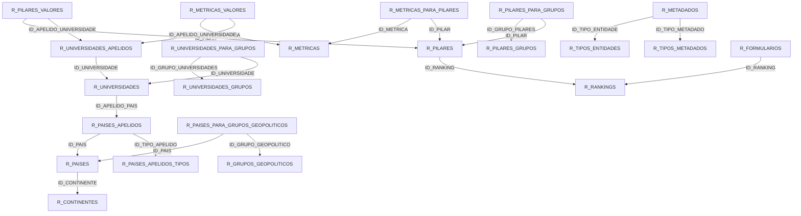

```mermaid
flowchart TD
    R_CONTINENTES
    R_PAISES
    R_PAISES_APELIDOS_TIPOS
    R_PAISES_APELIDOS
    R_GRUPOS_GEOPOLITICOS
    R_PAISES_PARA_GRUPOS_GEOPOLITICOS
    R_UNIVERSIDADES
    R_UNIVERSIDADES_APELIDOS
    R_UNIVERSIDADES_GRUPOS
    R_UNIVERSIDADES_PARA_GRUPOS
    R_RANKINGS
    R_PILARES
    R_METRICAS
    R_PILARES_GRUPOS
    R_PILARES_PARA_GRUPOS
    R_METRICAS_PARA_PILARES
    R_PILARES_VALORES
    R_METRICAS_VALORES
    R_TIPOS_METADADOS
    R_TIPOS_ENTIDADES
    R_METADADOS
    R_FORMULARIOS

    R_PAISES -- ID_CONTINENTE --> R_CONTINENTES
    R_PAISES_APELIDOS -- ID_PAIS --> R_PAISES
    R_PAISES_APELIDOS -- ID_TIPO_APELIDO --> R_PAISES_APELIDOS_TIPOS
    R_PAISES_PARA_GRUPOS_GEOPOLITICOS -- ID_PAIS --> R_PAISES
    R_PAISES_PARA_GRUPOS_GEOPOLITICOS -- ID_GRUPO_GEOPOLITICO --> R_GRUPOS_GEOPOLITICOS
    R_UNIVERSIDADES -- ID_APELIDO_PAIS --> R_PAISES_APELIDOS
    R_UNIVERSIDADES_APELIDOS -- ID_UNIVERSIDADE --> R_UNIVERSIDADES
    R_UNIVERSIDADES_PARA_GRUPOS -- ID_GRUPO_UNIVERSIDADES --> R_UNIVERSIDADES_GRUPOS
    R_UNIVERSIDADES_PARA_GRUPOS -- ID_UNIVERSIDADE --> R_UNIVERSIDADES
    R_PILARES -- ID_RANKING --> R_RANKINGS
    R_PILARES_PARA_GRUPOS -- ID_GRUPO_PILARES --> R_PILARES_GRUPOS
    R_PILARES_PARA_GRUPOS -- ID_PILAR --> R_PILARES
    R_METRICAS_PARA_PILARES -- ID_METRICA --> R_METRICAS
    R_METRICAS_PARA_PILARES -- ID_PILAR --> R_PILARES
    R_PILARES_VALORES -- ID_PILAR --> R_PILARES
    R_PILARES_VALORES -- ID_APELIDO_UNIVERSIDADE --> R_UNIVERSIDADES_APELIDOS
    R_METRICAS_VALORES -- ID_METRICA --> R_METRICAS
    R_METRICAS_VALORES -- ID_APELIDO_UNIVERSIDADE --> R_UNIVERSIDADES_APELIDOS
    R_METADADOS -- ID_TIPO_ENTIDADE --> R_TIPOS_ENTIDADES
    R_METADADOS -- ID_TIPO_METADADO --> R_TIPOS_METADADOS
    R_FORMULARIOS -- ID_RANKING --> R_RANKINGS
```